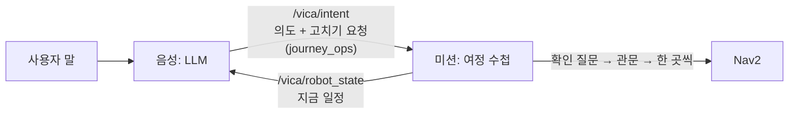

# 다중 목적지 여정 설계 — 하루 일정표를 들고 안내한다

2026-10-07 · 대상 저장소 `vica_ros2_ws`(미션·인터페이스) + `vica-voice-llm`(LLM·TTS)
· **구현은 시연(10-27 전후) 뒤** · 상태: 다섯 절 대화 승인(10-07), 이 문서 검토 대기

## 1. 무엇을 만드나

**로봇이 사용자 한 명의 하루 일정표를 들고 다닌다.**

여정 한 번 = Home 을 떠나 사용자를 안내하고 다시 Home 으로 돌아올 때까지다. 지금 로봇은
한 번에 목적지 하나만 안다. 그래서 "접수하고 내과 가야 돼"를 들어도 내과는 잊고, 사용자가
돌아올 때마다 처음부터 다시 말해야 한다.

비유: **미션 = 로봇의 수첩, LLM = 비서.** 비서가 사용자 말을 듣고 "수첩을 이렇게 고치자"고
요청하면, 미션이 확인하고 수첩을 고친다. 로봇이 움직이는 것은 지금처럼 한 곳씩, 확인한
뒤에만이다.

### 기준 시나리오 (병원, 사용자 제시)

| 순간 | 사용자 | 로봇 |
| --- | --- | --- |
| 다가가 안내 수락 뒤 | — | "…오늘 어디를 가실 예정이신가요?" |
| | "접수처에 가서 접수부터 하자" | "그다음 가실 곳이 있으신가요?" |
| | "접수하고 내과 가서 의사 선생님 만나야 돼. 그다음엔 검사를 할 수도 있어" | 일정: 접수처 → 내과 → (미정). "접수처로 안내해드릴까요?" |
| | "그래" | 접수처로 안내 → 도착 → 묻지 않고 "최대 30분 동안 … 기다리겠습니다" → 대기 장소 |
| 접수 뒤 | "비카야" | "돌아오셨군요. 내과로 바로 갈까요?" |
| | "응, 그런데 나 화장실이 가고 싶어" | 일정: 접수처(끝) → 화장실 → 내과. "화장실로 안내해드릴까요?" |
| | "그래" | 화장실 안내 → 대기 → 돌아오면 내과로 |
| 내과 도착 | — | "내과에 도착했습니다. 여기서 대기할까요?" (다음이 미정이라 묻는다) |
| 진료 뒤 | "엑스레이를 찍고 피검사를 해야 한대" | 일정에 영상의학과 검사실·건강검진 병동을 더함. "영상의학과 검사실로 안내할까요?" |

이 시나리오가 완성 기준이다(9절 시험 1번).

## 2. 정한 것 (2026-10-07 사용자 결정)

| 항목 | 결정 |
| --- | --- |
| 시기 | 시연 뒤 구현. 지금은 설계만 — 시연 전에는 음성 안정이 우선 |
| 관리 방식 | 일정표는 CRUD(넣기·보기·고치기·빼기)가 되어야 하고, **LLM 이 관리**한다 |
| 저장 | **미션**에 저장한다. LLM 은 고치기를 요청하고 미션이 확인해 고친다 |
| 출발 | 지금 그대로 한 곳씩: 확인 질문 → 미션 관문 → Nav2. 일정은 로봇을 직접 움직이지 않는다 |
| 도착 때 대기 | 일정에 **다음 곳이 있으면 묻지 않고 대기**("최대 30분 동안 …"), 다음이 미정이면 지금처럼 "여기서 대기할까요?" |
| 할 일 → 장소 | LLM 상식으로 추론하고 **출발 전에는 늘 확인**. 틀리면 사용자가 고쳐 준다고 본다. 관리자 등록 칸은 만들지 않는다 |
| 앱 | 첫 판은 음성만. 로봇 상태에 일정을 실어 두어 앱은 나중에 화면만 더한다 |
| 범위 | 한 번에 사용자 한 명, 한 층. 다른 층(엘리베이터)·앱 원격 주행·배달은 일정에 넣지 않는다 |
| 보관 | 병원 방문은 개인 정보 — 여정이 끝나면 바로 지운다 |

## 3. 구조 — 누가 무엇을

| 곳 | 하는 일 |
| --- | --- |
| 미션 `journey.py`(새 순수 로직 모듈) | 일정 보관·확인 규칙·다음 곳 판단. 진행 중 일정은 파일에 저장해 미션을 다시 켜도 남긴다 |
| 미션 `mission_logic.py` | 도착·"비카야"·끝내기 때 수첩을 보고 규칙을 적용(6·7절) |
| 인터페이스 `vica_interfaces` | `VicaIntent` 에 고치기 요청 목록, 새 메시지 `JourneyOp`, `RobotState` 에 일정 칸 |
| 음성 LLM | 소리·글자 경로가 고치기 요청을 채운다. 장소 이름 → 목적지 id 매핑, 일정 메모 줄 만들기 |
| 음성 TTS | 새 고정 멘트를 굽고, 목적지 이름이 든 멘트는 미리 합성 |
| 앱 | 첫 판 없음 |

새 노드는 만들지 않는다 — 수첩은 미션 안의 모듈이다.

**고치기를 의도 메시지에 싣는 까닭:** 말 한 번에 LLM 을 한 번만 부르기 위해서다. 고치기마다
따로 부르면 대답이 늦고, 실시간 모델의 분당 호출 한도(약 7회)에 빨리 닿는다. "화장실
들렀다가 내과 가자"처럼 한 문장에 여럿이어도 한 번에 실린다.

## 4. 일정표의 모양과 시작·끝

**여정(Journey)** = 정류장 목록 + "그다음 미정" 표시 하나.

**정류장(Stop)** 한 칸:

| 칸 | 뜻 |
| --- | --- |
| 목적지 id | 목적지 목록의 id (이름은 목록에서 찾는다) |
| 상태 | 예정 / 지금 / 끝 / 건너뜀 |
| 할 일 메모 | 사용자가 말한 할 일을 짧게(최대 20자) — 예: 내과 "의사 선생님 만나기", 영상의학과 검사실 "엑스레이" |

LLM 메모에 보이는 모양(음성 `ledger_view` 가 만든다):
`- 오늘 일정: 접수처(끝) → 화장실(지금) → 내과(의사 선생님 만나기) → (그다음 미정)`

`RobotState` 에는 목적지 id·상태·메모를 칸으로 싣고 한국어 줄은 음성 쪽이 만든다(지금 대장
메모와 같은 나눠 맡기). 앱도 나중에 같은 칸을 읽는다.

**"다음 곳"** = '예정' 칸 중 맨 앞. 예정 칸이 없으면 "다음 곳 없음"이다 — "그다음 미정"이 켜져
있든(아직 모름) 꺼져 있든(일정 끝) 도착·호출 규칙에서는 같게 다룬다(6절: 묻는다).

**시작:** 일정에 첫 칸이 생길 때 열린다 — 접근 질문에 "네" 한 뒤든 "비카야" 뒤든 같다. 한
곳만 말하면 정류장 하나짜리 여정이고, 지금 안내와 똑같이 동작한다.

**끝:** Home 으로 돌아가기 시작하면 닫고 **바로 지운다**(파일 포함).
- 안내 종료(남은 곳이 없을 때 "다 됐어"), 무응답 떠남, 대기 만료(M7), 관리자 홈 복귀·앱 선점
- 새 사람에게 다가가기 시작할 때도 이전 일정을 지운다

**지우지 않는 경우:**
- 비상 정지 — 해제 뒤에도 남는다. 로봇이 혼자 다시 출발하지는 않는다(지금 원칙). 사용자가 "비카야"로 이어 간다.
- 일시정지·주행 중 목적지 바꾸기 — 일정 안의 일로 다룬다.

## 5. 고치기 요청 (CRUD)

`JourneyOp` 하나 = 요청 하나. `VicaIntent.journey_ops` 에 여러 개를 순서대로 싣고, 미션은 순서대로
적용한다.

| 요청 | 예 | 일정표 변화 |
| --- | --- | --- |
| 넣기 `add` | "내과도 가야 돼" | 자리: 맨 뒤(기본) / 다음 / OO 앞 / OO 뒤. 급한 곳("화장실 가고 싶어")은 LLM 이 '다음'으로 |
| 빼기 `remove` | "검사는 안 해도 된대" | 예정 칸을 뺀다 |
| 옮기기 `move` | "검사 먼저 할게" | 자리를 옮긴다(넣기와 같은 자리 표현) |
| 바꾸기 `replace` | "내과 말고 외과야" | 그 칸의 목적지·할 일 메모를 바꾼다 |
| 미정 표시 `open_end` | "그다음은 아직 몰라" | "그다음 미정"을 켜고 끈다 |

"보기"는 요청이 없다 — LLM 메모에 늘 지금 일정이 있다.

**미션의 확인 규칙**
- 목적지 목록에 있고 갈 수 있는(공개·접근 가능) 곳만 넣는다. 목록에 없는 이름은 음성 쪽이
  id 를 못 찾아 그 요청을 버리고, LLM 이 되묻는다(clarify).
- 이미 예정에 있는 곳은 두 번 넣지 않는다.
- '끝' 칸은 기록이라 고치거나 뺄 수 없다. **'지금' 칸을 빼는 것은 고치기가 아니라** 지금의
  "안내를 취소할까요?" 흐름(되묻기)으로 처리한다.
- 지킬 수 없는 요청은 무시하고 로그만 남긴다 — 다음 메모에 실제 일정이 보이므로 LLM 이 맞춘다.

**고치기와 출발은 별개다**
- 고치기만으로는 움직이지 않는다. 출발은 지금처럼 확인 질문("접수처로 안내해드릴까요?") →
  "네" → 미션 관문이다. 한 의도 메시지에 고치기와 출발 제안을 같이 실을 수 있다.
- 일정에 없는 곳으로 출발이 확정되면(그냥 "식당 가자") 미션이 그곳을 '다음' 자리에 넣는다 —
  LLM 이 넣기를 빠뜨려도 일정이 실제와 어긋나지 않게.
- 출발하면 그 칸이 '지금', 도착하면 '끝'이 된다.

## 6. 대화 흐름

1절 시나리오 그대로다. 미션이 말하는 것은 고정 멘트, LLM 이 말하는 것은 상황에 맞춘 말이다.

| 순간 | 로봇이 하는 말 | 누가 |
| --- | --- | --- |
| 접근 수락 뒤 온보딩 | 끝말을 "오늘 어디를 가실 예정이신가요?"로 | 미션 |
| 일정이 한 곳뿐이고 그다음을 모를 때 | "그다음 가실 곳이 있으신가요?" (한 번만) | LLM |
| 출발 전 | "OO로 안내해드릴까요?" / 추론한 곳은 "엑스레이 찍으러 영상의학과 검사실로 갈까요?" | LLM |
| 도착 — 다음 곳 있음 | 도착 말(+M1) + "최대 30분 동안 {장소}에서 기다리겠습니다…"(M2′) → 대기. 대기 장소가 없는 목적지는 지금의 제자리 대기 멘트(MSG_WAIT_DEFAULT) | 미션 |
| 도착 — 다음 미정 | 도착 말(+M1) + "여기서 대기할까요?" (지금 그대로) | 미션 |
| 대기 중 "비카야" — 다음 곳 있음 | "돌아오셨군요. {OO}로 바로 갈까요?" ("네?" 대신, 답을 기다림) | 미션 |
| 대기 중 "비카야" — 다음 미정 | "네?" (지금 그대로) | 미션 |
| 대기 중 "다 됐어" — 다음 곳 있음 | "네, {OO}로 바로 갈까요?" | 미션 |
| 대기 중 "다 됐어" — 다음 미정 | "네, 어디로 모실까요?" (10-07 만든 것) | 미션 |
| 남은 곳이 있는데 "다 끝났어"·"그만 갈래" | "{OO}은/는 안 가셔도 될까요?" → 네면 안내 종료·Home, 아니요면 이어 감 | 미션 |
| 주행 중 다른 곳 | 오늘 만든 "바꿀까요?" 흐름. 확정되면 **새 곳을 먼저 들르고 가던 곳은 일정에 남긴다**. "OO 말고 XX"처럼 분명히 바꿀 때만 바꾸기 | LLM·미션 |
| 대기 만료 | M7 후 Home — 남은 곳이 있어도 여정을 닫는다(30분 안에 안 돌아옴) | 미션 |

"OO로 바로 갈까요?"에 "네"면 미션은 그 다음 곳을 확인 중(CONFIRMING, 대기 보류)으로 들고
있다가 지금의 확인 답 통로(on_confirm_answer)로 출발한다.

**새 고정 멘트** (구현 전에 문구 승인, 다른 미션 멘트처럼 CosyVoice F2 로 굽기)

| # | 문장 | 굽기 |
| --- | --- | --- |
| J1 | 오늘 어디를 가실 예정이신가요? (온보딩 끝말) | 온보딩 전체를 다시 굽는다 |
| J2 | 돌아오셨군요. {OO}로 바로 갈까요? | "돌아오셨군요."는 굽고, 뒷문장은 목적지마다 미리 합성 |
| J2′ | 네, {OO}로 바로 갈까요? | J2 의 변형 — 목적지마다 미리 합성 |
| J3 | {OO}은/는 안 가셔도 될까요? | 목적지마다 미리 합성(은/는 함수) |

## 7. 기존 기능과의 연결

| 기존 기능 | 바뀌는 점 |
| --- | --- |
| 도착 후 대화(ASKING_NEXT) | 다음 곳이 있으면 질문을 건너뛰고 대기 확정(M2′, 최대 30분) |
| 대기 장소·M3·M6·M7 | 그대로 |
| "비카야" 반응표 | WAITING·WAITING_RELEASE 에서 다음 곳이 있으면 "네?" 대신 J2(판정은 그대로 listen) |
| 주행 중 목적지 바꾸기(10-07) | 확정 = 새 곳을 '다음'에 넣고 가던 곳은 남김 |
| 대기 중 "다 됐어"(10-07) | 다음 곳이 있으면 J2′, 두 번째 끝말은 J3 확인 |
| 접근 온보딩 | 끝말을 J1 로 |
| LLM 메모·지시문 | 일정 줄, 고치기 규칙(5절), "그다음 가실 곳" 묻기 규칙 |

## 8. 안전·예외

- **로봇을 움직이는 길은 하나뿐이다:** 확인 질문 → 미션 관문 → Nav2. 고치기는 일정표만 바꾼다.
  LLM 이 잘못 고쳐도 출발 전 확인 질문에서 사용자가 바로잡는다.
- 비상 정지·"멈춰"는 지금 그대로(일정과 무관하게 늘 통하고, 해제 뒤 저절로 출발하지 않음).
- 미션 재시작: 진행 중 일정은 파일에서 되살린다. 여정이 끝나면 파일도 지운다.
- 잘못된 요청(모르는 곳·중복·끝난 칸): 무시하고 로그.
- **로컬 LLM(믿음) 대피 중:** 작은 모델은 고치기 목록을 잘 못 채운다 — 대피 중에는 고치기를 받지
  않고 한 곳씩 안내로 낮춘다. 이미 있는 일정은 남아 J2 는 계속 된다.
- 프라이버시: 일정은 그 여정 동안만. 로그에는 지금처럼 목적지 이름만 남는다.

## 9. 시험

1. **미션 순수 로직:** 고치기 5종·확인 규칙·도착/호출/끝내기 규칙 단위 시험 + **1절 시나리오를 처음부터
   끝까지 재생하는 시험**.
2. **LLM 채점 묶음:** 한국어 문장 30~50개마다 정답 일정(고치기 요청)을 두고 소리·글자 경로를
   채점한다(로컬 LLM 벤치 도구와 같은 방식). 할 일 → 장소 추론 문장을 포함한다.
3. **두 저장소 계약 시험:** 메시지 칸, 새 멘트 글자, 은/는 함수.
4. **실기:** 시나리오 대본대로 시연장 목적지에서.

## 10. 단계 (모두 시연 뒤)

1. 미션 여정 수첩 + `RobotState` 일정 칸 + 도착·호출·끝내기 규칙. LLM 없이 시험 도구로 고치기를 넣어 검증.
2. `VicaIntent`·`JourneyOp` 메시지 + LLM 고치기(소리 경로 먼저) + 메모 줄 + 새 멘트 굽기·미리 합성.
3. 글자 경로·로컬 대피 축소 동작, 주행 중 바꾸기와 일정 연결, 채점 묶음.
4. 앱 여정 카드(나중).

## 11. 구현 계획 때 정할 것 (제안값 포함)

| 거리 | 제안 |
| --- | --- |
| 메시지 칸 이름 | `JourneyOp{op, place_id, where, ref_place_id, new_place_id, memo, open_end}`, `RobotState{journey_stop_ids[], journey_stop_states[], journey_stop_memos[], journey_open_end}` |
| "그다음 가실 곳이 있으신가요?" 시점 | 일정이 한 곳뿐이고 미정 여부를 모를 때 한 번 |
| 일정 파일 | 대장 파일 옆(`ledger` 와 같은 폴더), 여정 끝에 삭제 |
| 지시문 길이 | 일정 줄은 한 줄 — Realtime 토큰 증가를 실기 로그(cached 토큰)로 잰다 |
| J2 의 판정 | 대기 중 호출이므로 listen 그대로, 답("응")은 확인 답 통로로 |
