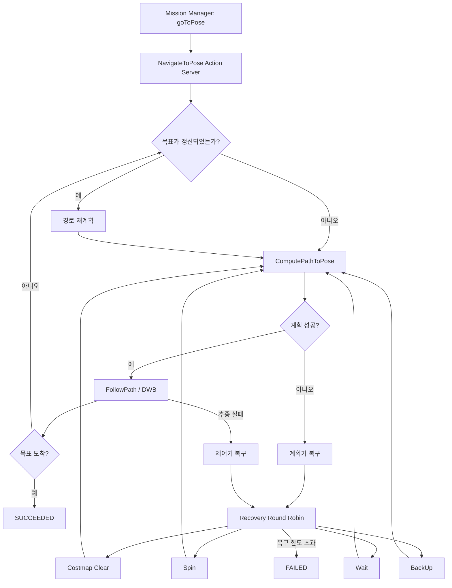
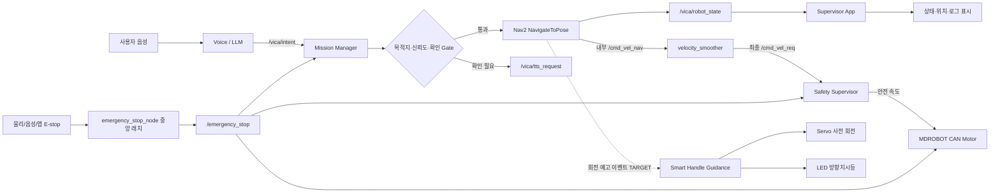
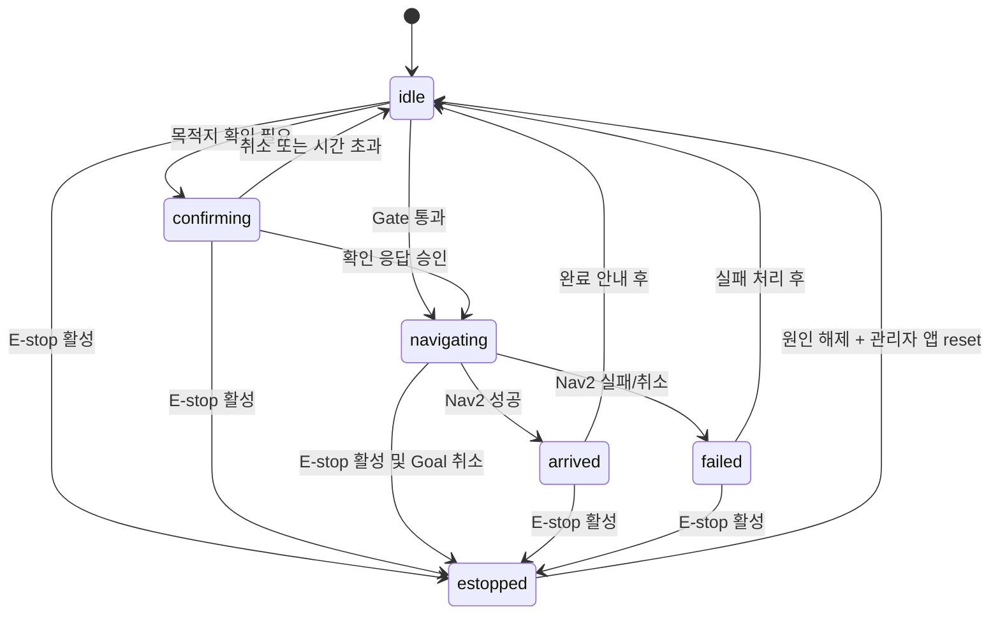
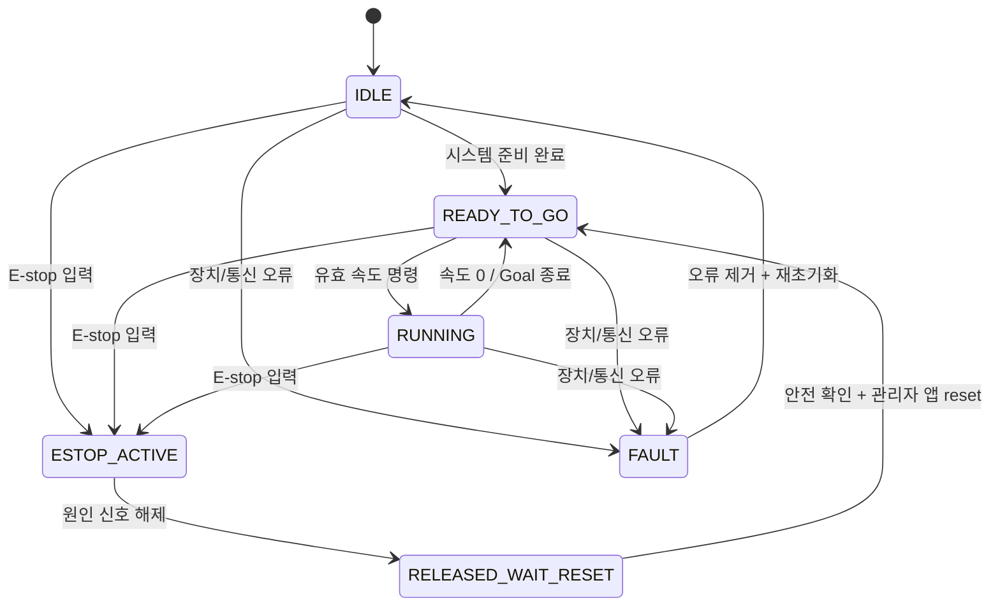
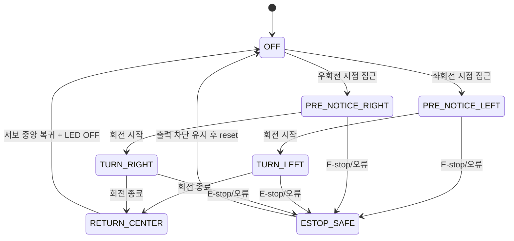
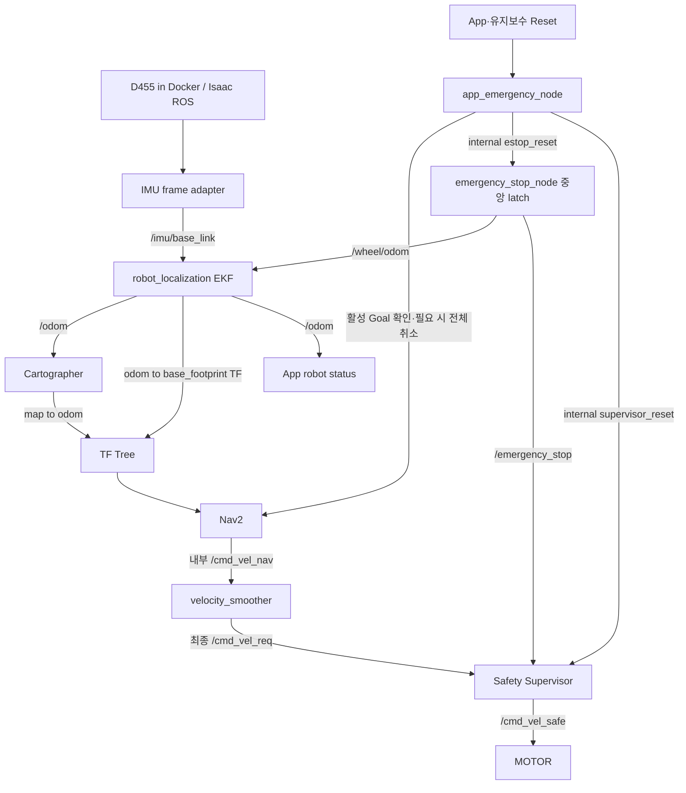

# VICA BT 및 폴더·파일 Visual Hierarchy

> 기준: 이 문서가 포함된 작업공간 루트의 현재 소스 트리
> 목적: Nav2 BT 실행 구조, VICA 상태 흐름, 저장소별 책임과 핵심 파일 위치를 한 문서에서 확인한다.
> 상세 동작은 `vica_scenario.md`, 시스템 계약은 `vica_architecture.md`를 우선한다.

## 1. 표기 규칙

| 표기 | 의미 |
|---|---|
| `[CURRENT]` | 현재 소스에 구현되어 있거나 현재 설정으로 사용되는 항목 |
| `[GAP]` | 파일은 있으나 연결·설정이 불완전하거나 현재 실행 경로와 불일치하는 항목 |
| `[TARGET]` | 스마트핸들 서보·LED 등 앞으로 추가할 구조 |
| `[GENERATED]` | 빌드로 생성되며 직접 수정하지 않는 디렉터리 |

## 2. 현재 BT 구성 요약

### 2.1 저장소에 사용자 정의 BT XML은 없다

현재 `vica_ros2_ws/src/vica_nav2`에는 사용자 정의 Behavior Tree XML이 없다. `nav2_params.yaml`의 `default_nav_to_pose_bt_xml`과 `default_nav_through_poses_bt_xml`도 주석 상태이므로, `nav2_bt_navigator`가 설치된 Nav2의 기본 BT를 선택한다.

- 단일 목적지: `navigate_to_pose_w_replanning_and_recovery.xml`
- 다중 경유지: `navigate_through_poses_w_replanning_and_recovery.xml`
- VICA Mission Manager가 현재 호출하는 액션: `NavigateToPose`
- 경로 계획기: NavFn
- 경로 추종기: DWB
- 복구 동작: 비용지도 초기화, 회전, 대기, 후진 등 Nav2 기본 복구 노드

아래 그림은 저장소 설정과 Nav2 기본 동작을 기준으로 단순화한 개념도다. 실제 BT 노드와 포트의 최종 기준은 실행 중 선택된 Nav2 설치본의 XML이다.



### 2.2 BT 변경 원칙

BT를 사용자 정의할 때는 XML만 추가하지 말고 다음 항목을 함께 변경한다.

1. `vica_nav2/behavior_trees/`에 XML을 추가한다.
2. `setup.py`의 `data_files`에 XML 설치 규칙을 추가한다.
3. `nav2_params.yaml`에서 기본 BT XML 경로를 명시한다.
4. E-stop 중 액션 취소, 복구 중 속도 명령 차단, 재시작 시 수동 reset 조건을 시험한다.
5. BT Navigator가 로드한 XML 경로를 시작 로그에서 확인한다.

## 3. VICA 상위 동작 흐름



점선은 현재 직접 연결이 완성되지 않았거나 앞으로 추가할 경로다.
`nav2_map_test.launch.py`는 Nav2 내부 `/cmd_vel_nav`는 유지하면서 velocity smoother의
최종 출력을 `/cmd_vel_req`로 remap한다. motor node는 `/cmd_vel_safe`를 구독한다.
`vica_safety`의 중앙 래치와 앱·유지보수 reset 오케스트레이션도 코드와 launch로
구현됐지만 CAN·Nav2·motor 종단 동작은 `[미검증]`이다.

## 4. 상태 전이 Visual Hierarchy

### 4.1 Mission Manager 상태



E-stop 해제 뒤에는 이전 Goal을 자동 재개하지 않는다. 로그인한 관리자가 앱 확인 팝업을
통해 reset한 다음 새 목적지를 요청하는 흐름을 기본으로 한다.

### 4.2 안전 상태

현재 안전 로직과 앱 표시를 함께 해석할 때의 운영 상태는 다음처럼 관리한다.



앱은 최소한 현재 위치, 주행 중, 멈춤, 비상정지, 오류를 구분해 표시하고 상태 변화를 로그로 남긴다. 로그인 기능은 확정된 제품 요구사항이지만 현재 Flutter 소스에 로그인 화면과 인증 라우팅이 없으므로 `[TARGET]`(구현 목표)으로 관리한다. 구현 후에는 임의로 제거하지 않는다.

### 4.3 스마트핸들 회전 예고 `[TARGET]`



| 단계 | 서보모터 | LED | 햅틱 | 종료 조건 |
|---|---|---|---|---|
| `OFF` | 중앙 또는 무구동 안전 위치 | 파란색 기본 점멸(직진) | 없음 | 회전 감지·예고 수신 |
| `PRE_NOTICE_LEFT` | 좌측으로 완만히 이동 | 좌측 황색 점멸 | 없음 | 실제 좌회전 시작 |
| `PRE_NOTICE_RIGHT` | 우측으로 완만히 이동 | 우측 황색 점멸 | 없음 | 실제 우회전 시작 |
| `TURN_LEFT/RIGHT` | 해당 방향 유지 | 해당 방향 황색 점멸 | 없음 | 회전 완료 또는 취소 |
| `RETURN_CENTER` | 중앙으로 완만히 복귀 | 파란색 기본 점멸 복귀 | 없음 | 중앙 도달 |
| `ESTOP_SAFE` | 구동 출력 차단 | 비상 패턴 또는 꺼짐 | 비상 알림 신호 | 명시적 reset |

## 5. 전체 저장소 Visual Hierarchy

아래 트리는 직접 관리하는 핵심 파일 위주다. `build/`, `install/`, `log/`, Flutter 생성 파일과 캐시는 생략한다.

```text
VICA-smarthandle/
├── .gitattributes                              # 팀 문서 LF·binary 속성 기준
├── .gitignore                                  # 제품 저장소·생성물·secret 루트 제외 규칙
├── README.md                                   # 팀 workspace 진입·구성 방법
├── AGENTS.md                                   # 통합 작업 지침 (단일 AGENTS 파일)
├── GOVERNANCE.md                               # 팀·AI 협업, 변경 승인, 배포 기준
├── CLAUDE.md                                   # 전역 요약 지침
├── workspace.repos                             # 세 제품 저장소 개발 branch manifest
├── guideline/                                  # 통합 문서
│   ├── vica_scenario.md
│   ├── vica_architecture.md
│   ├── bt와 visual hierarchy of your folders and files.md
│   └── official_reference_urls.md              # 참고 URL 목록, 개발 중 발견 시 추가
├── source_file/                                # 로컬 원본 보관, 루트 Git 제외
│   ├── hong igk.drawio
│   └── *.pdf                                   # MDROBOT·J401 매뉴얼 등
├── devlog/                                     # 날짜별 개발 로그 (YYYY-MM-DD.md, 팀 공유)
├── log/                                        # [GENERATED] 로컬 로그, 루트 Git 제외
│
├── vica_ros2_ws/                               # ROS 2 주행·안전·하드웨어
│   ├── README.md
│   ├── vica.repos
│   ├── maps/
│   ├── location/
│   ├── bags/
│   ├── scripts/
│   ├── docs/
│   ├── ekf_config/                             # 호환용 설정, 정본은 vica_localization
│   └── src/
│       ├── vica_interfaces/
│       ├── vica_mission_manager/
│       ├── vica_nav2/
│       ├── mdrobot_can_control/
│       ├── vica_safety/
│       ├── encoder_feedback/
│       ├── vica_localization/                  # wheel+IMU EKF, 표준 /odom
│       ├── vica_sensor_adapters/
│       ├── vica_description/
│       ├── vica_cartographer/
│       └── rplidar_ros/                        # 현재 실사용 RPLIDAR 드라이버(vica.repos import)
│
├── vica-voice-llm/                             # 음성·의도·목적지 매칭
│   ├── launch/
│   ├── src/
│   ├── config/
│   ├── tests/
│   ├── backend/
│   ├── docs/
│   ├── references/
│   └── ros2_ws/src/vica_interfaces/            # 인터페이스 사본, 동기화 필요
│
└── VICA_Supervisor/                            # Flutter 감독 앱 + ROS 보조 노드
    ├── lib/
    │   ├── core/
    │   ├── models/
    │   ├── providers/
    │   ├── ros/
    │   ├── screens/
    │   └── widgets/
    ├── ros2/
    ├── docs/
    ├── assets/
    ├── android/
    ├── linux/
    └── web/
```

LLM과 앱은 dependency와 배포 주기가 다르므로 별도 Git 저장소를 유지한다. 공용 계약과
배포 버전은 루트 거버넌스 자료에서 중앙 관리한다. 장기적으로 앱 저장소의 로봇 측
`ros2/` 보조 노드는 ROS workspace의 별도 bridge 패키지로 이동하되, 승인 전에는 현재
위치를 유지한다.

루트 `.gitignore`는 세 제품 디렉터리와 `source_file/`을 커밋하지 않도록 제외한다.
팀원은 루트 저장소를 받은 뒤 `vcs import . < workspace.repos`로 세 저장소를 같은 상대
경로에 구성한다. 개발 manifest는 branch를 사용하며 release manifest는 검증된 tag 또는
commit SHA로 고정한다.

## 6. ROS 2 패키지와 핵심 파일

```text
vica_ros2_ws/src/
├── vica_interfaces/                            # 공통 메시지 계약
│   └── msg/
│       ├── VicaIntent.msg
│       ├── RobotState.msg
│       └── EmergencyEvent.msg
│
├── vica_mission_manager/                       # 음성 의도 → Goal, 상태 전이
│   ├── launch/mission_manager.launch.py
│   └── vica_mission_manager/
│       ├── mission_manager_node.py
│       ├── mission_logic.py
│       ├── destinations.py
│       ├── emergency_estop_bridge.py
│       └── estop_pulse.py
│
├── vica_destination_manager/                   # 지도별 목적지 YAML 정본
│   ├── launch/destination_manager.launch.py
│   ├── vica_destination_manager/
│   │   ├── destination_manager_node.py
│   │   └── storage.py
│   └── test/test_storage.py
│
├── vica_nav2/                                  # Nav2 실행·파라미터
│   ├── launch/nav2_map_test.launch.py
│   └── config/nav2_params.yaml
│
├── mdrobot_can_control/                        # CAN actuator adapter only
│   ├── launch/motor_bringup.launch.py
│   └── mdrobot_can_control/
│       ├── can_preflight.py                    # CAN IFF_UP 읽기 전용 시작 검사
│       └── mdrobot_can_keyboard_knob_node.py
│
├── vica_safety/                                # 독립 안전 계층
│   ├── launch/safety_bringup.launch.py         # Safety 3노드, motor 미포함
│   ├── docs/estop_integration_development_direction.md
│   └── vica_safety/
│       ├── emergency_latch.py
│       ├── emergency_stop_node.py              # 물리·앱·음성 중앙 latch
│       ├── safety_gate.py
│       ├── safety_supervisor_node.py            # /cmd_vel_req 최종 승인
│       ├── reset_sequence.py
│       └── app_emergency_node.py                # 공개 reset 오케스트레이터
│
├── encoder_feedback/                           # 휠 엔코더 Odometry
│   └── encoder_feedback/encoder_feedback.py
│
├── vica_localization/                          # wheel+IMU EKF와 표준 /odom bringup
│   ├── config/
│   │   ├── encoder.yaml
│   │   └── ekf.yaml                            # EKF 설정 정본
│   ├── launch/wheel_ekf.launch.py
│   ├── test/test_ekf_contract.py
│   └── README.md
│
├── vica_sensor_adapters/                       # IMU·VSLAM 프레임/공분산 보정
│   └── vica_sensor_adapters/
│       ├── imu_base_link_adapter.py
│       └── vslam_covariance_adapter.py
│
├── vica_description/                           # URDF/Xacro, mesh, TF 정적 구조
│   ├── urdf/VICA.xacro
│   ├── meshes/
│   ├── launch/
│   └── rviz/
│
├── vica_cartographer/                          # 2D SLAM
│   ├── launch/
│   │   ├── vica_cartographer_2d.launch.py
│   │   └── vica_slam_bringup.launch.py         # localization 포함 SLAM 통합 launch
│   └── config/vica_2d.lua
│
├── ekf_config/                                 # 호환용 설정 사본, 정본은 vica_localization
│   ├── ekf.yaml
│   └── command.txt
└── rplidar_ros/                                # 현재 실사용 RPLIDAR 드라이버(vica.repos import). YDLIDAR G2 수리 중
```

`vica_ros2_ws/src`의 VICA 패키지는 11개이고, `vica.repos`로 외부 드라이버
(`rplidar_ros`, `ydlidar_ros2_driver`, `realsense-ros`)를 import하면 현재
`colcon list`에 18개가 나온다. `vica_localization`이 `robot_localization` EKF 설정과
bringup의 정본이며 `ekf_config`는 호환용 사본이다. `rplidar_ros`는 현재 실사용
라이다이고 YDLIDAR G2는 수리 중이라 복귀 시 원복한다(2026-07-22 기준). 호환 사본은
임의로 수정하지 않고 정본 변경과 함께 동기화한다.

## 7. 음성 저장소 핵심 파일

```text
vica-voice-llm/
├── launch/vica_voice.launch.py                 # 현재 음성 스택 시작점
├── config/destinations.yaml                    # 목적지 사전
├── src/
│   ├── ros_node.py                             # 의도 ROS 브리지
│   ├── emergency_filter.py                     # 긴급 키워드 판정
│   ├── ros_emergency_node.py                   # EmergencyEvent 발행
│   ├── destination_matcher.py
│   ├── langchain_intent_parser.py
│   ├── ros_tts_node.py
│   ├── ros_robot_state_stub.py                 # [GAP] 개발용 stub
│   └── ros_state_machine_stub.py               # [GAP] 개발용 stub
├── tests/
├── backend/
└── ros2_ws/src/vica_interfaces/                # [GAP] 원본과 중복된 메시지
```

현재 launch는 실제 LLM/TTS/E-stop 노드와 함께 두 stub을 실행한다. 통합 실행 시 stub이 실제 Mission Manager 상태와 충돌하지 않도록 개발 모드 옵션으로 분리해야 한다. 또한 Mission Manager는 `/vica/tts_request`를 발행하지만 현재 TTS 노드는 `/vica/intent`를 구독하므로 계약 통합이 필요하다. `vica_interfaces` 사본은 독립 정본이 아니며 ROS 저장소의 원본과 버전 동기화해야 한다.

## 8. Supervisor 앱 핵심 파일

```text
VICA_Supervisor/
├── lib/
│   ├── main.dart
│   ├── app.dart                                # SupervisorShell 시작
│   ├── core/
│   │   ├── app_settings.dart
│   │   ├── log_filter.dart
│   │   └── map_coordinate.dart
│   ├── models/
│   │   ├── robot_status.dart
│   │   ├── supervisor_log.dart
│   │   ├── vica_map.dart
│   │   └── location_point.dart
│   ├── providers/
│   │   ├── supervisor_provider.dart
│   │   └── settings_provider.dart
│   ├── ros/ros_bridge_client.dart
│   ├── screens/
│   │   ├── dashboard_screen.dart
│   │   ├── current_location_screen.dart
│   │   ├── robot_management_screen.dart
│   │   ├── map_locations_screen.dart
│   │   ├── save_location_screen.dart
│   │   ├── logs_screen.dart
│   │   └── settings_screen.dart
│   └── widgets/
│       ├── status_badge.dart
│       ├── map_canvas.dart
│       └── vica_ui.dart
└── ros2/
    ├── vica_status_app_node.py                 # 위치·주행·대기·오류 JSON 상태
    ├── location_storage_node.py                # 폐기 안내용, 실행 즉시 종료
    ├── map_list_node.py
    └── vica_goto_goal.py                       # Mission service CLI client
```

일반 운영 Goal 권한은 Mission Manager 하나다. Flutter와 `vica_goto_goal.py`는
`/vica/mission/request_destination`으로 UUID를 요청한다. 지도별 YAML 저장은
`vica_ros2_ws/src/vica_destination_manager/`가 담당한다. 실제 Nav2·motor 종단은
`[미검증]`이다.

## 9. 현재 데이터·제어 경로의 핵심 GAP



우선 해결할 항목은 다음과 같다.

1. `robot_localization`, `python3-can`을 설치하고 깨끗한 환경에서 localization build/test를 재검증한다.
2. 실제 C5 `/wheel/odom`과 D455 `/imu/base_link`를 함께 입력해 `/odom`과 `odom -> base_footprint` 단일 발행자를 HIL에서 검증한다.
3. Cartographer와 Nav2에서 확정된 `/odom` 연결을 runtime으로 검증한다.
4. Nav2 `/cmd_vel_req` → Safety Supervisor → `/cmd_vel_safe` → CAN 경로를 HIL에서 검증한다.
5. motor의 `/cmd_vel_safe` 단일 입력을 build/runtime에서 검증한다.
6. `vica_safety` 중앙 래치와 reset 오케스트레이션을 build/test한다.
7. 앱·유지보수 reset이 Nav2 취소, 중앙 래치 해제, Supervisor READY를 순서대로 확인하는지 HIL에서 검증한다.
8. Mission Manager와 앱 직접 Goal 노드 중 Goal 권한자를 하나로 정한다.

## 10. 스마트핸들 추가 시 권장 Target Tree

아래 구조는 아직 현재 WS에 없는 목표안이다. 기존 패키지가 있는 것처럼 문서나 launch에서 참조하면 안 된다.

```text
vica_ros2_ws/src/
├── vica_interfaces/msg/
│   ├── TurnGuide.msg                           # [TARGET] 방향·단계·거리·유효시간
│   └── SmartHandleState.msg                    # [TARGET] 접촉·서보/LED/햅틱 fault
│
└── vica_user_guidance/                         # [TARGET]
    ├── package.xml
    ├── setup.py
    ├── launch/user_guidance.launch.py
    ├── config/user_guidance.yaml
    └── vica_user_guidance/
        ├── turn_guide_node.py                  # 1단계: EKF odometry yaw 변화량 → LEFT/RIGHT
        │                                       # 2단계(추후): Nav2 path look-ahead 사전 예고
        └── user_guidance_driver_node.py        # 서보(좌·우 안내)·햅틱(비상 알림)
                                                # LED: 회전 시 해당 방향 황색, 직진 시 파란색 기본 점멸
                                                # 아두이노 나노가 장치 제어, heartbeat 프로토콜 없음
```

노드 구성은 [vica_architecture.md](vica_architecture.md) 12절의
2노드안(판단 `turn_guide_node` / 출력 `user_guidance_driver_node` 분리)으로 통일한다.
driver는 Safety 상태를 turn guide를 거치지 않고 직접 구독한다.

회전 판단은 단계적으로 구현한다. 1단계는 EKF 융합 odometry의 yaw 변화량을 기준으로
좌·우 회전을 감지해 서보와 방향 지시등 LED를 구동하고, 2단계에서 Nav2 path look-ahead
기반 사전 예고(PRE_NOTICE)로 확장한다. 4.3절의 PRE_NOTICE 상태는 2단계 기준이다.

안전 규칙은 다음과 같이 고정한다.

- E-stop 또는 fault 시 서보·LED 일반 안내 출력을 즉시 중지한다.
- 오래된 회전 이벤트는 `timestamp/TTL`로 폐기한다.
- 서보 각도, 속도, 지속시간은 하드 리밋과 소프트 리밋을 모두 둔다.
- 안내 장치 고장은 주행 제어 토픽을 직접 생성하지 않는다.
- 회전 이벤트 생성자는 Nav2 계획 경로와 로봇 pose를 사용하되, Goal 권한을 갖지 않는다.

## 11. 문서와 코드 확인 순서

변경 작업을 시작할 때 다음 순서로 읽는다.

1. 루트 `AGENTS.md`
2. 루트 `GOVERNANCE.md`
3. 변경 유형에 맞는 guideline 문서
4. 변경 대상 저장소의 실제 launch, params, node 코드
5. 외부 자료가 필요할 때 `guideline/official_reference_urls.md`와 공식 원문

모든 작업에서 통합 문서 3개 전체를 무조건 읽지 않는다. 서비스 동작은 scenario,
인터페이스·Safety·TF는 architecture, BT·구조는 이 문서를 선택한다. 문서와 코드가
다르면 현재 소스와 실행 결과를 우선하고 영향받는 문서만 같은 변경에서 갱신한다.
공식 URL 문서는 프로젝트 설명 문서에 흡수하거나 삭제하지 않고 별도 출처 목록으로
유지한다.
